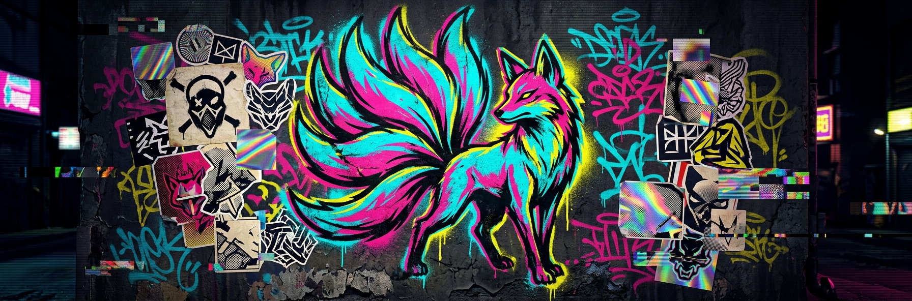

# Davide Mastricci

**AI Product Engineer** &nbsp;·&nbsp; `0 → 1` &nbsp; prototype → production → payments → paying users

I build and ship AI products end to end, all the way to billing and paying users. 
Founder of **[aisthetix](https://www.aisthetix.com)**. I also architect multi-tenant platforms and ship RAG and agent systems for industry.

---

### ▚ Building

**[aisthetix](https://www.aisthetix.com)** · my AI virtual try-on and size-estimation SaaS for Shopify. Shoppers drop a photo, see the garment on themselves, and get a fit recommendation. Built solo, end to end: storefront widget, embedded admin, subscription billing, inference backend, infra.

`React` `TypeScript` `Node` `FastAPI` `MongoDB` `Redis` `Gemini Vision` `GPT-4V` `CLIP` `Stripe` `Shopify Billing` `Docker`

### ▚ Selected work

*Client names withheld. Technology only.*

**RAG assistant for an industrial energy operator.** Table-aware PDF extraction, page-level citations, a multi-model LLM strategy, and a local-first pipeline so the whole thing runs on a laptop before it touches the cloud.

`React` `FastAPI` `Cloud Run` `pgvector` `Vertex AI` `Gemini`

**Multi-tenant campaign-orchestration platform** *(role: architect)*. Event-driven, with real-time atomic payment settlement, per-tenant isolation down to the database row, and an immutable audit trail. 18 ADRs and a full C4 model.

`Node/TS` `EKS` `PostgreSQL + RLS` `Kafka` `ClickHouse` `Auth0` `Vault` `Stripe Connect`

**AI agents for debt collection, for a UK fintech.** Autonomous collection agents grounded in policy, live call-assist that feeds human agents suggestions mid-call, and automated transcript analysis.

`LLM agents` `RAG` `Python` `WhatsApp / SMS`

### ▚ Previously

3Sides (social-media-aesthetics AI dashboard)  ·  EU Horizon research ML (PLOTO, Agro2Circular, RELEVIUM).

---

### ▚ Stack

**Languages** &nbsp; `Python` `TypeScript` `Node`  
**AI / LLM** &nbsp; `Anthropic Claude` `Gemini / Vertex AI` `OpenAI` `RAG` `agents` `pgvector`  
**Frontend** &nbsp; `React` `Next.js` `Tailwind` `shadcn/ui`  
**Backend / Infra** &nbsp; `FastAPI` `AWS / EKS` `GCP / Cloud Run` `Kafka` `Docker` `Vercel`  
**Data** &nbsp; `PostgreSQL` `MongoDB` `Redis` `ClickHouse`

---

**Let's build something.** 
[LinkedIn](https://www.linkedin.com/in/davidemastricci/) &nbsp;·&nbsp; [davide.mastricci7@gmail.com](mailto:davide.mastricci7@gmail.com)
 Based in Italy, working with teams everywhere.

